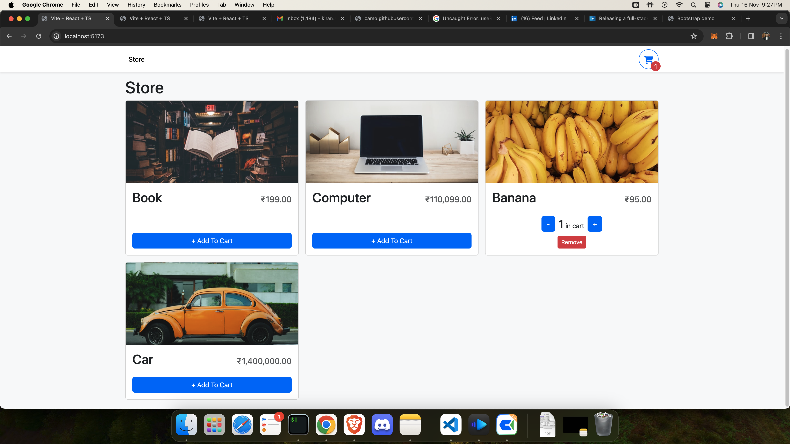

# React TS BootStrap shopping cart

This is a template for creating a shopping cart



## How it works

Fork or download the repo and change whatever you need to change for your needs.

## Running Locally

Can run the application in VS Code or a terminal and it will be available at `http://localhost:5173`.

```bash
npm install
npm run dev
```
